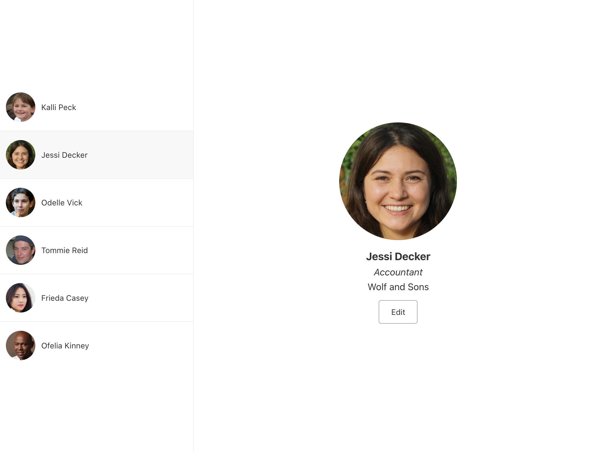
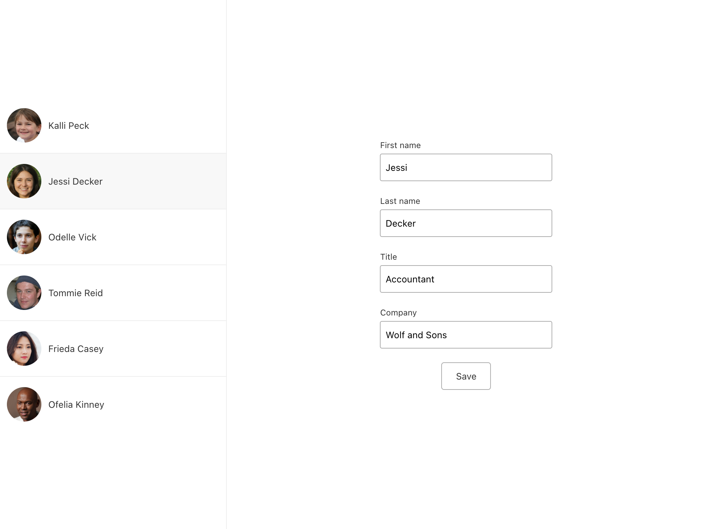
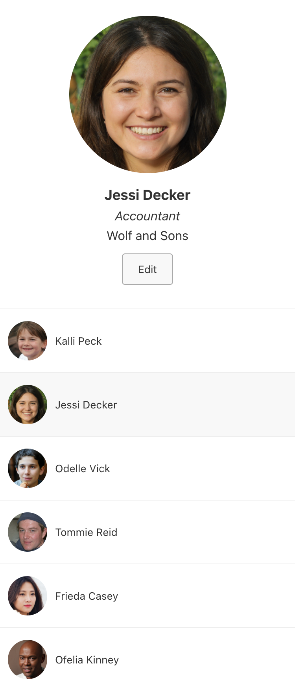
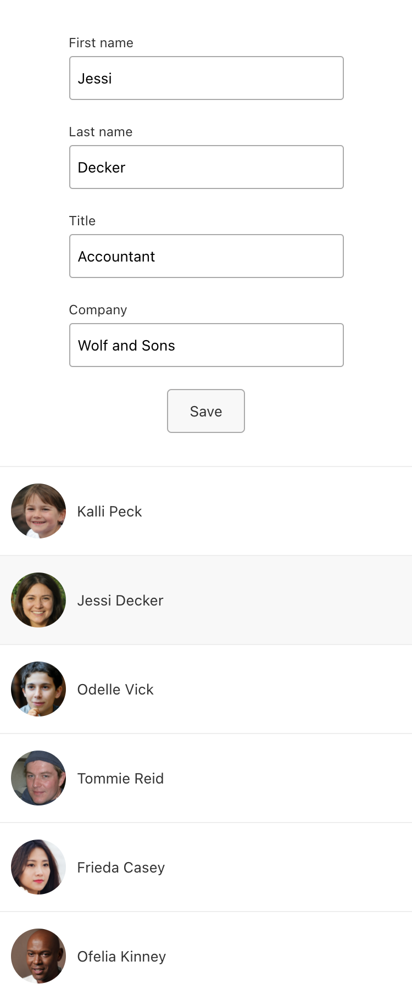

# Bevy front end take home project

- [Getting started](#getting-started)
- [Tech used](#tech-used)
    - [Next.js](#nextjs)
    - [SCSS](#scss)
    - [Testing](#testing)
- [Tasks](#tasks)
- [When you’re done](#when-youre-done)

## Getting started

Install the dependencies.

```bash
npm ci
```

Run the development server.

```bash
npm run dev
```

Open [http://localhost:3000](http://localhost:3000) in your browser to see the app.

## Tech used

- React + Next.js
- SCSS/CSS
- Jest + React Testing Library

### Next.js

This project focuses on your React skills, so don’t worry if you’re not familiar with Next.js. Here’s a brief breakdown of some of the directories used by Next.js. To complete the tasks below, you shouldn’t have to change anything in these folders.

- The `pages` directory contains client and server side routed views built with React components. For instance, a file named `page/about.js` would appear at `http://localhost:3000/about`.
- The `pages/_app.js` file gives us a way to provision data before the top level component is rendered.
- The `pages/api` directory contains API routes for fetching from other components.
- The `styles` directory contains some global styles.

### SCSS

This project is set up with Sassy CSS (SCSS), but you can write plain CSS to complete the styling tasks if you like.

### Testing

Tests can be run in watch mode with `npm test`. You should ensure all tests pass when you’re done completing the tasks below, even tests currently being skipped. If you think some additional tests might be useful and you have some extra time, add them.

## Tasks

We’ve designed this take home project to test your proficiency in some important skills required of a front end engineer. It should take no more than **3 hours** to complete. Don’t worry if you run into issues and can’t complete everything.

The simple app you’ll be working with displays a list of users. Clicking a user in the list displays a full card view for that user. You can then edit that user’s information.

Your user edits will revert on refresh. That’s fine for this assignment.

In a new branch, complete the following tasks in order.

- [ ] **1. An npm module is missing.** Install it and restart the server.
- [ ] **2. Buttons don’t do anything.** Update buttons to perform an action on click.
- [ ] **3. Editing a user does not update their name in the list.** Add the missing piece that will update the related state.
- [ ] **4. Edit mode is missing the fields to edit title and company.** Add them.
    Ensure the saved changes persist when you click to a different user and back to the edited user.
- [ ] **5. A bug renders first and last names with no space between them.** Fix the bug.
- [ ] **6. The card for the first user should show on page load.** Add or refactor the code to make it happen.
- [ ] **7. The layout doesn’t yet match the design.** Update the styles to match the design.
    Below are all the designs you’ll need, for wide and narrow viewports.

    Note: The designs are @2x/HiDPI/Retina, so the visual output would be half the size. You’ll want to open the images in a separate tab or app to ensure they’re displaying at the intended size.
    <details><summary>Design mockups</summary><p>

    
    
    
    

    </p></details>
    In narrow viewports, the larger user area (user card) should stick to the top and the list should scroll behind it.
- [ ] **8. Update tests.** Ensure all tests pass. See the [Testing](#testing) section above for more info.
- [ ] **9. The list of users should be able to be closed.** Add a way to toggle the user list. When the list is not visible, the card should fill the space.
- [ ] **10. The user card will need to adapt to changes in its size.** Using a custom hook, add a way to record the current dimensions of the user card to the console. When its size changes, due to the window resizing or the list toggling (task 9), use `console.log` to print the new size.

## When you’re done

Edit this README file to add your answers to these questions. Then open a pull request for your branch.

#### What would you change about the architecture of this app?

_Your answer here_

#### What issues did you encounter and how did you solve them?

_Your answer here_
